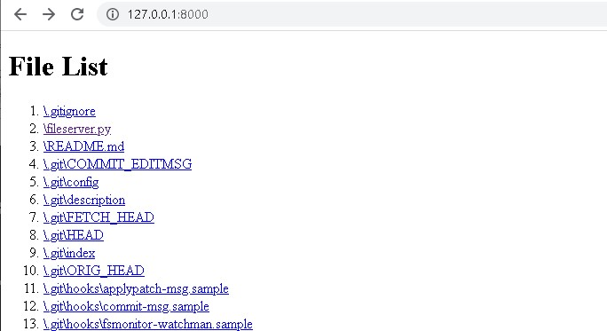

# Flask_File_Server
A Flask File Server

## Install Dependencies
```sh
> pip install flask
```
## Run a file server
```sh
> python fileserver.py
```
## Change file storage path
In the `fileserver.py`
```
if __name__ == "__main__":
    dir_path = os.getcwd()
    storage_path = dir_path
    RunFileServer(storage_path, 8000)
```
Replace `storage_path` to the absolute path of the folder you want to host files in.
## How the file server looks like.
